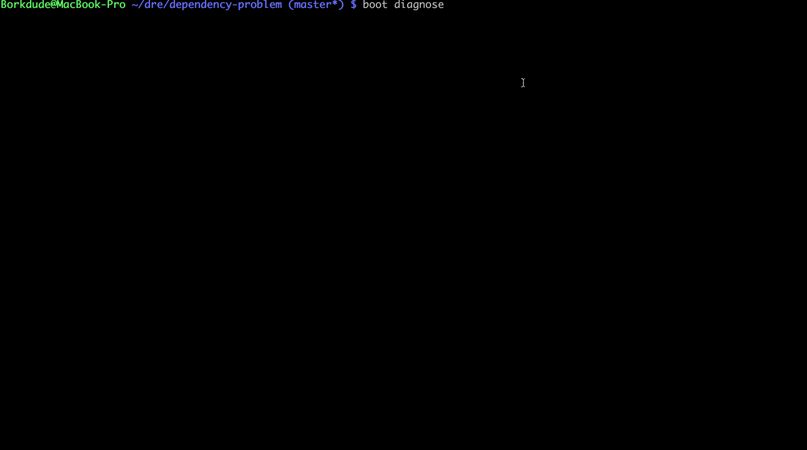

# dependency-problem

## Diagnosing a dependency problem with clojure.spec and boot.



### Introduction

I had a weird problem with Manifold (comes with Yada and Aleph). The following expression would throw an exception:

```clojure
@(d/let-flow [a (d/success-deferred {:a 1})]
  a)
;; => java.lang.ClassCastException: java.lang.Long cannot be cast to java.util.Map$Entry
```

I noticed that with a fresh project, this exception didn't occur:

```clojure
;; boot -d manifold repl
(require '[manifold.deferred :as d])
(d/let-flow [a (d/success-deferred {:a 1})] a)
;;=> << {:a 1} >>
```

So the problem was probably in the combination of one of our other libraries with Manifold.
Because we have quite a few dependencies I decided it was too much work bisecting them by hand.
Clojure.spec and Boot to the rescue!

## Solution

I used clojure.spec to generate random subsets of our dependencies. For each subset a script is generated which executes the above code snippet.
If the script would return an exit code other than zero, we would have found the problematic dependency. Using clojure.test.spec I could find the smallest failing subset of dependencies. It turned out to be only one dependency in our case.

## Running

Clone this repo and run `boot diagnose` to run the clojure.spec.test test or `boot confirm` to see the failing example.

## Funding

This software was commissioned and sponsored by [Doctor Evidence](http://doctorevidence.com/). The Doctor Evidence mission is to improve clinical outcomes by finding and delivering medical evidence to healthcare professionals, medical associations, policy makers and manufacturers through revolutionary solutions that enable anyone to make informed decisions and policies using medical data that is more accessible, relevant and readable.

## License

Copyright Michiel Borkent 2017.

Distributed under the Eclipse Public License either version 1.0 or (at your option) any later version.
